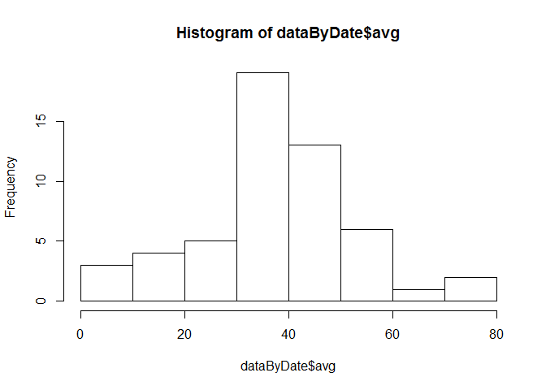
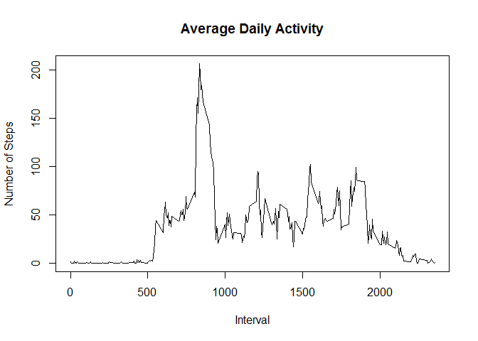
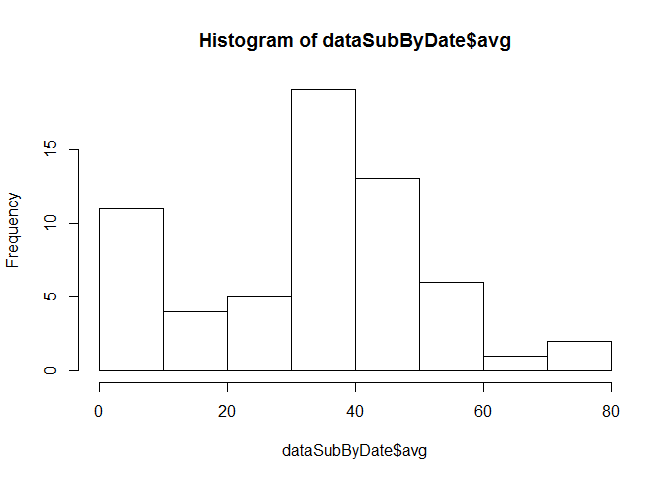
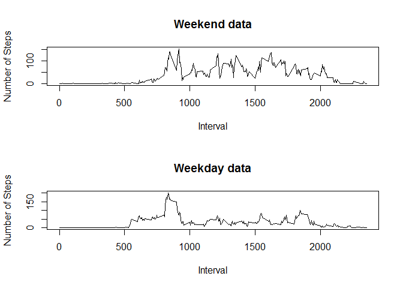

# Reproducible Research: Peer Assessment 1
## Introduction
This report is my submission of Peer Assessment 1 for the Cousera Class "Reproducible Data".

The report was prepared using __R markdown__ (RStudio rmd file) and processed by __knitr__ and then transformed into a __HTML__ file.

### Data
The assigment requires the analysis of data from a personal activity monitoring device.  The data file was downloaded from the course web site and saved to the working directory used for this assignment.  The data file has the following variables:

* steps: Number of steps taking in a 5-minute interval (missing values are coded as NA)

* date: The date on which the measurement was taken in YYYY-MM-DD format

* interval: Identifier for the 5-minute interval in which measurement was taken

The dataset is stored in a comma-separated-value (CSV) file and there are a total of 17,568 observations in this dataset


## Loading and preprocessing the data
> Show any code that is needed to load the data (i.e. read.csv())and process/transform the data (if necessary) into a format suitable for your analysis


```r
library(dplyr)
```

```
## 
## Attaching package: 'dplyr'
## 
## The following object is masked from 'package:stats':
## 
##     filter
## 
## The following objects are masked from 'package:base':
## 
##     intersect, setdiff, setequal, union
```

```r
library(tidyr)
setwd("~/Coursera/05_Reproducible Data/project 01")
dataRaw <- read.csv("Activity monitoring data.csv")
```

Examine the data file


```r
head(dataRaw)
```

```
##   steps       date interval
## 1    NA 2012-10-01        0
## 2    NA 2012-10-01        5
## 3    NA 2012-10-01       10
## 4    NA 2012-10-01       15
## 5    NA 2012-10-01       20
## 6    NA 2012-10-01       25
```

```r
str(dataRaw)
```

```
## 'data.frame':	17568 obs. of  3 variables:
##  $ steps   : int  NA NA NA NA NA NA NA NA NA NA ...
##  $ date    : Factor w/ 61 levels "2012-10-01","2012-10-02",..: 1 1 1 1 1 1 1 1 1 1 ...
##  $ interval: int  0 5 10 15 20 25 30 35 40 45 ...
```

## What is mean total number of steps taken per day?

First calculate the total number of steps taken per day while ignoring the missing values in the dataset.


```r
dataClean <- filter(dataRaw, !is.na(steps))
dataByDate <- dataClean %>% group_by(date) %>% summarise(avg = mean(steps, na.rm = TRUE))
```

> Make a histogram of the total number of steps taken each day

 

> Calculate and report the mean and median of the total number of steps taken per day


```r
mean(dataByDate$avg)
```

```
## [1] 37.3826
```

```r
median(dataByDate$avg)
```

```
## [1] 37.37847
```

## What is the average daily activity pattern?

> Make a time series plot (i.e. type = "1") of the 5-minute interval (x-axis) and the average number of steps taken, averaged across all days (y-axis)

 

> Which 5-minute interval, on average across all the days in the dataset, contains the maximum number of steps?


```r
dataByInterval %>% filter(avg == max(avg))
```

```
## Source: local data frame [1 x 2]
## 
##   interval      avg
## 1      835 206.1698
```

## Imputing missing values

Note that there are a number of days/intervals where there are missing values (coded as NA). The presence of missing days may introduce bias into some calculations or summaries of the data.

> Calculate and report the total number of missing values in the dataset (i.e. the total number of rows with NAs)


```r
sum(is.na(dataRaw$steps))
```

```
## [1] 2304
```

The next step is to replace all of the missing values in the dataset. The approach used is to replace the mising data with the median for the full data set.


```r
dataSub <- dataRaw
dataSub$steps[is.na(dataSub$steps)] <- median(dataSub$steps, na.rm=TRUE)

# Confirm all NA values have been replaced
head(dataSub)
```

```
##   steps       date interval
## 1     0 2012-10-01        0
## 2     0 2012-10-01        5
## 3     0 2012-10-01       10
## 4     0 2012-10-01       15
## 5     0 2012-10-01       20
## 6     0 2012-10-01       25
```

```r
sum(is.na(dataSub$steps))
```

```
## [1] 0
```

> Make a histogram of the total number of steps taken each day 

 

> Calculate and report the mean and median total number of steps taken per day.


```r
mean(dataSubByDate$avg)
```

```
## [1] 32.47996
```

```r
median(dataSubByDate$avg)
```

```
## [1] 36.09375
```

The values differ from the estimates from the first part of the assignment.  As shown in the historgrams the addition of the missing data results in a less sysmetrical distribution and this results in a lower average and median.

## Are there differences in activity patterns between weekdays and weekends?

Note for this portion of the assignment used the dataset with the filled-in missing values for this part.

As part of the analysis created a new factor variable called "Day" in the dataset with two levels - "weekday" and "weekend" indicating whether a given date is a weekday or weekend day.


```r
testData <- mutate(dataSub, Day = weekdays(as.Date(dataSub$date)))

testData$Day[testData$Day  == "Monday"] <- "weekday"
testData$Day[testData$Day  == "Tuesday"] <- "weekday"
testData$Day[testData$Day  == "Wednesday"] <- "weekday"
testData$Day[testData$Day  == "Thursday"] <- "weekday"
testData$Day[testData$Day  == "Friday"] <- "weekday"
testData$Day[testData$Day  == "Saturday"] <- "weekend"
testData$Day[testData$Day  == "Sunday"] <- "weekend"

head(testData)
```

```
##   steps       date interval     Day
## 1     0 2012-10-01        0 weekday
## 2     0 2012-10-01        5 weekday
## 3     0 2012-10-01       10 weekday
## 4     0 2012-10-01       15 weekday
## 5     0 2012-10-01       20 weekday
## 6     0 2012-10-01       25 weekday
```

```r
str(testData)
```

```
## 'data.frame':	17568 obs. of  4 variables:
##  $ steps   : num  0 0 0 0 0 0 0 0 0 0 ...
##  $ date    : Factor w/ 61 levels "2012-10-01","2012-10-02",..: 1 1 1 1 1 1 1 1 1 1 ...
##  $ interval: int  0 5 10 15 20 25 30 35 40 45 ...
##  $ Day     : chr  "weekday" "weekday" "weekday" "weekday" ...
```

> Make Plot

Made plot containing a time series plot (i.e. type = "l") of the 5-minute interval (x-axis) and the average number of steps taken, averaged across all weekday days or weekend days (y-axis).


```r
testDataWeekday <- filter(testData, Day == "weekday")
testDataWeekday <- testDataWeekday %>% group_by(interval) %>% summarise(avg =mean(steps, na.rm = TRUE))

testDataWeekend <- filter(testData, Day == "weekend")
testDataWeekend <- testDataWeekend %>% group_by(interval) %>% summarise(avg =mean(steps, na.rm = TRUE))

# Make a pannel with two time series plots
par(mfrow = c(2, 1))

plotData <- testDataWeekend
with(plotData, plot(testDataWeekend$interval, testDataWeekend$avg, 
     type = "l", xlab = "Interval", ylab = "Number of Steps", main = "Weekend data"))

plotData <- testDataWeekday
with(plotData, plot(testDataWeekday$interval, testDataWeekday$avg, 
     type = "l", xlab = "Interval", ylab = "Number of Steps", main = "Weekday data"))
```

 

end of file
